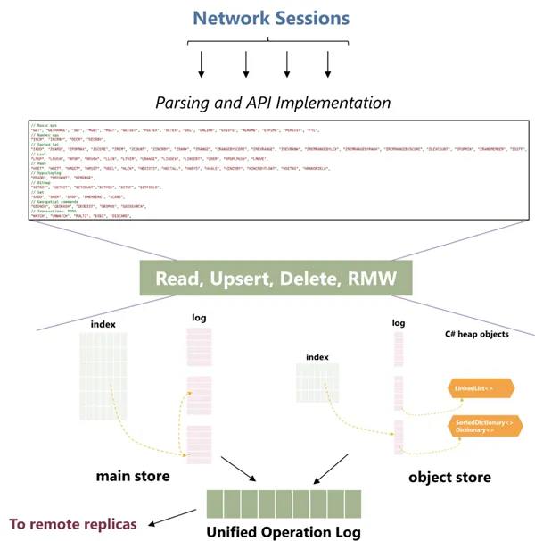

软研究院数据库小组高级首席研究员 Badrish Chandramouli 介绍，**Garnet 项目是基于 C# .NET8.0 从零开始构建而成，且以性能为核心考量**。

## Garnet 优势

一、Garnet 采用流行的**RESP 线路协议**作为起点，因此大多数用户可以不作任何修改、就直接通过大多数编程语言编写的 Redis 客户端直接接入 Garnet。
二、Garnet 通过多条客户端连接与小批量形式提供更好的可扩展性与吞吐量，帮助大型应用程序和服务节约运行成本。
三、Garnet 在第 99 及第 99.9 百分位上表现出更好的客户端延迟水平，更高比例的稳定性表现对于现实场景而言至关重要。
四、Garnet 基于最新.NET 技术，具有跨平台、可扩展和现代化等特点，它在设计上易于开发与调整，且不致牺牲常见场景下的性能水平。
那么 Gartner 具体性能表现如何呢，**微软研究团队通过对此展示了 Gartner 与其他领先开源缓存存储方案间的关键性能指标**。

## 实验一：不同数量客户端会话的吞吐量比较

数据库大小为（a）1024 个键及（b）2.56 亿个键时，不同数量客户端会话对应的吞吐量（对数坐标）
